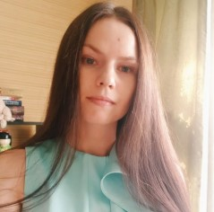

# Iuliia Kuvshinchikova

## Contacts

* **Location:** Tula, Russia
* **Discord:** Julia (@JuliaKuvsh)
* **GitHub:** [JuliaKuvsh](https://github.com/JuliaKuvsh)
* **Telegram:** ["Frontend junessa"](https://t.me/frontend_junessa)
  
## About Me

I am an editor and copywriter with 10 years of experience. But recently I decided to change my profession and become a front-end developer.

I am attentive to details, easily find a common language with people and know how to work under the pressure of deadlines.

## Skills

* HTML5
* CSS3
* Less/Sass
* JavaScript
* Git and GitHub
* Figma
* Perfect Pixel
* Basic knowledge:
    + PHP
    + Vue.js

## Code Example

[Isograms](https://www.codewars.com/kata/54ba84be607a92aa900000f1)

```JavaScript

function isIsogram(str){
  let newStr = str.toLowerCase();
  if (newStr == " ") {
    return true;
  } else {
      for(let i = 0; i < newStr.length; i++) {
        for(let j = i + 1; j < newStr.length; j++) {
          if(newStr[i] === newStr[j]) {
            return false;
          }
        }
      }
      return true;
    } 
  }
```

## Experience

* [Kekstagram](https://github.com/JuliaKuvsh/2037569-kekstagram-26)
* [Cat Energy](https://juliakuvsh.github.io/2037569-cat-energy-25/)

## Education

* Tula State Lev Tolstoy Pedagogical University, Bachelor's degree in Social and Economic Sciences (2009-2013)
* **HTML Academy**
    * HTML & CSS.Adaptive Website Coding and Automation (March – May, 2022)
    * JavaScript.Professional Development of Web Interfaces (May – August, 2022)
* **RS School** "JavaScript/Front-end"

## Language Skills

* **English:** Upper intermediate (B2) - [Cambridge Assessment English (2021)](https://drive.google.com/file/d/1Ouqmb9pTID6ii4LF3ks_IDpDlS-H0gsS/view)

